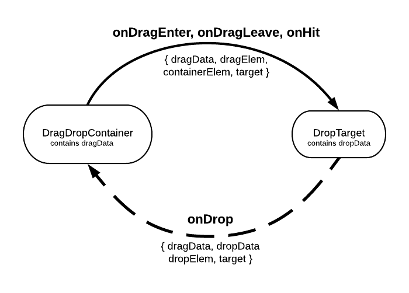

# DragContainer and DropContainer

## Features

- Very easy to implement and understand.

- Works on mouse and touch devices.

- Automatically scrolls the page when you drag to the edge, so you can drag to a target that's initially offscreen.

- Optional drag handles (with `dragHandleClassName` prop).

- Can automatically highlight the DropContainer when dragging over it (`highlightClassName` property).

- Can constrain dragging to one dimension with `xOnly` and `yOnly` properties.

- Useful options like `dragClone` (drag a copy of the element), `customDragElement` (drag a custom element rather than the source element), and `disappearDraggedElement` (make the original element completely disappear while dragging).

- Can implement using the components as wrappers or by passing them a render prop.

---

## Installation

---

## Basics

Set up a draggable element and a drop target for it:

```
import { DragContainer, DropContainer } from './le-dnd';

<DragContainer targetKey="foo" >
    <div>Drag Me!</div>
</DragContainer>

<DropContainer targetKey="foo" >
    <p>I'm a valid drop target for the object above since we both have the same targetKey!</p>
</DropContainer>
```

---

## Anatomy of a Drag and Drop



- While dragging, the `onDragEnter` and `onDragLeave` events fire in the `DropContainer`. On a successful drop, the `onHit` event fires. These all pass the event data shown.

- On a successful drop, the `onDrop` event fires in the `DragContainer`, passing back the event data shown.

---

## Wiring Up the DragContainer:

```
<DragContainer
    targetKey="foo"
    dragData={some object}
    onDrop={some method}
    onDragStart={some method}
    onDrag={some method}
    onDragEnd={some method}
>
    <div>Drag Me!</div>
</DragContainer>
```

`targetKey`: Determines what DropContainers it can be dropped on.

`dragData`:Custom data to pass to the drop target.

`onDrop`: Callback that fires after a successful drop on a compatible target. See [onDrop Event Data](#ondrop-event-data), below.

`onDragStart`, `onDrag`, `onDragEnd` (less commonly used): Callbacks during the drag process. See details in [DropContainer Callbacks](#DropContainer-callbacks) below.

##### onDrop Event Data

Passed back to `DragContainer` in the `onDrop` event:

```
{
    dropData: [whatever you put in the dropData prop for the DropContainer]
    dropElem: [reference to the DOM element being dragged]
    dragData: [whatever you put in the dragData prop]
    target: [reference to the DragContainer DOM element]
    ...plus a lot of standard react/js event data
}
```

---

## Wiring Up the DropContainer:

```
<DropContainer
    targetKey="foo"
    dropData={some object}
    onHit={some function}
    onDragEnter={some function}
    onDragLeave={some function}
>
    <p>Drop something on me</p>
</DropContainer>
```

`dropData`: Custom data to pass back to the DragContainer.

`onDragEnter`, `onDragLeave`, `onHit`: Callbacks that fire when a compatible DragContainer
passes over. `onHit` is when a compatible container is dropped on the target. See event data below.

##### Event Data for DropContainer

Passed in `onDragEnter`, `onDragLeave`, and `onHit`:

```
{
    dragData: [whatever you put in the dragData prop for the DragContainer]
    dragElem: [reference to the DOM element being dragged]
    containerElem: [reference to the DragContainer DOM element]
    target: [reference to the DropContainer DOM element]
    ...plus a lot of standard event data
}
```

---

## Examples

### DropContainer with Multiple targetKeys

Wrap the element in multiple `DropContainer`s, one for each `targetKey`:

```
  <DropContainer targetKey="foo">
    <DropContainer targetKey="bar">
      <div>You can drop a "foo" or a "bar on me</div>
    </DropContainer>
  </DropContainer>
```

### Draggable Drop Target

Wrap the element in a `DragContainer` and a `DropContainer`:

```
  <DragContainer targetKey="foo">
    <DropContainer targetKey="bar">
      <div>You can drop a "bar" on me, or drag and drop me onto a "foo"</div>
    </DropContainer>
  </DragContainer>
```

### Apply Hover Highlighting to a DropContainer

By default the container for your DropContainer has the classname 'highlighted' applied when a compatible DragContainer is hovering over it.

```
  <style>
    .highlighted .my_target {background-color: 'lightblue'}
  </style>

  <DropContainer targetKey="foo" onHit={this.dropped}>
    <div className="my_target">I turn blue when you drag a "foo" over me</div>
  </DropContainer>
```

...or do it manually with the onDragEnter and onDragLeave events:

```
  <DropContainer targetKey="foo"
    onHit={this.dropped}
    onDragEnter={this.highlight}
    onDragLeave={this.unHighlight}
    >
    <div>Drop something on me</div>
  </DropContainer>
```

...where `highlight` and `unHighlight` are your own methods.

### Make the target "consume" the draggable

Use `event.containerElem` to hide or delete the original element after a successful
drop. In your DropContainer element:

```
  ...
  dropped(e){
      e.containerElem.style.visibility = 'hidden';
  }
  render() {
    return <DropContainer targetKey="foo" onHit={this.dropped}>[element code]</DropContainer>
  }
  ...
```

### Use with a Render Prop

If you prefer, you can specify a render prop rather than a child component for `DragContainer` or `DropContainer`.
These are equivalent:

```
    <DragContainer targetKey="foo">
        <div>Drag Me!</div>
    </DragContainer>
```

and

```
    <DragContainer
        targetKey="foo">
        render={() => return <div>Drag Me!</div>}
    />
```

---

## DragContainer Props

### Key Props

These are not required, but you'll almost always want to set them.

##### dragData

Data about the dragged item that you want to pass to the target. Default is empty object.

##### targetKey

Optional string to specify which DropContainers will accept which DragContainers. Default is 'ddc'.

### Other Props

##### customDragElement

If a DOM node is provided, we'll drag it instead of the actual object (which
will remain in place).

Example:

```
const elem = <div class="drag_elem">Drag Me</div>;

<DragContainer customDragElement={elem}>
```

##### disappearDraggedElement

If true, then dragging an element causes it to disappear such that it takes up no space. Defaults to
false, so that the original element space is still reserved while you are dragging. Not compatible with
`dragClone`.

##### dragClone

If true, then the user appears to be dragging a copy of the original element (false by
default, so that the user appears to be dragging the element itself).

##### dragElemOpacity

Opacity of the element while it's dragging. (Sometimes you want to be able to see what's below the
element you're dragging.) Default is 0.9 (e.g. 90%).

##### dragHandleClassName

Class name for drag handle(s). Optional. If omitted, the whole thing is grabbable.

**Tip:** If you are using drag handles on an element that contains an image,
use `<img draggable="false"...` to prevent the browser from letting users
drag the image itself, which can be confusing.

##### noDragging

If true, dragging is turned off.

##### xOnly, yOnly

If true, then dragging is constrained to the x- or y direction, respectively.

##### zIndex

The z-index for the dragged item. Defaults to 1000 (so that it floats over the target).
If that doesn't work for you, change it here.

#### DragContainer Callbacks

All optional. You'll generally set `onDrop`, but often skip the others.

##### onDragStart(dragData)

Runs when you start dragging. `dragData` is whatever you passed in with
the dragData prop.

##### onDrag(dragData, currentTarget, x, y)

Runs as you drag. `currentTarget` is the DOM element you're currently dragging
over; `x` and `y` are the current position.

##### onDragEnd(dragData, currentTarget, x, y)

When you drop.

##### onDrop(e)

Triggered after a drop onto a compatible DropContainer. This gets passed an event object, see [onDrop Event Data](#ondrop-event-data).

---

## DropContainer Props

##### targetKey

Optional string to specify which DragContainers this target will accept.

##### dropData

Data to be provided to the DragContainer when it is dropped on the target.

##### highlightClassName

CSS classname to apply when a compatible DragContainer is hovering over the DropContainer. Defaults to `highlighted`. Set to empty string if you do not want any highlight behavior.

#### DropContainer Callbacks

All optional; specify in props.

##### onDragEnter(e), onDragLeave(e), onHit(e)

The event e contains

```
{
    dragData: [whatever you put in the dragData prop for DragContainer]
    dragElem: [reference to the DOM element being dragged]
    containerElem: [reference to the DragContainer DOM element]
    sourceElem: [reference to the DOM element containing children of DragContainer]
}
```

---

## Development

To view locally, clone the repository then

```
$ npm install
$ npm run start
```

The demo will run on http://localhost:3000/

File locations:

```
/src/demo-app  Source code for demo app
/src/jd-dnd Source code for dnd library
```

## License

MIT License

Copyright (c) 2020.
